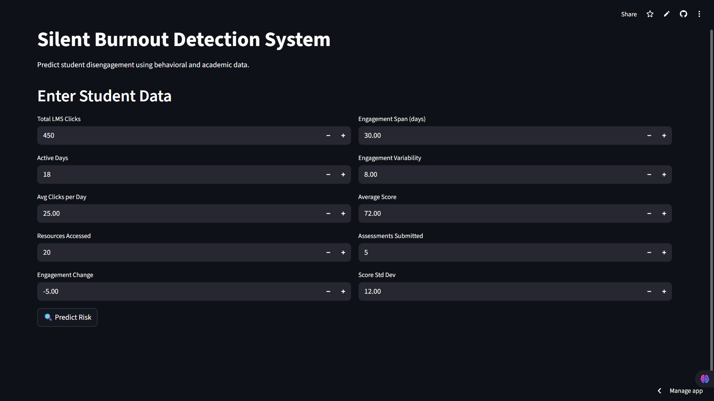
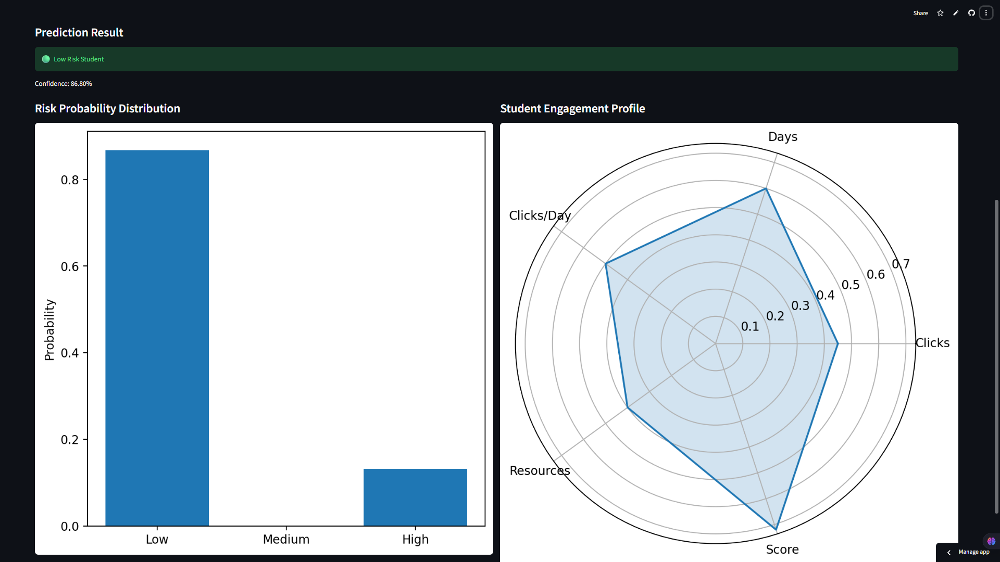

# Silent Burnout AI

Silent Burnout AI is a machine learning-based early warning system designed to detect academic disengagement and potential silent burnout risk among students using Learning Management System (LMS) behavioral data and academic performance indicators.

The system predicts whether a student belongs to a **Low Risk**, **Moderate Risk**, or **High Risk / Potential Withdrawal** category and displays the result through an interactive Streamlit dashboard.

---

## Live Demo

The Silent Burnout AI web application is deployed using Streamlit Community Cloud.

**Live App:** https://silent-burnout.streamlit.app/

---

## Application Screenshots

### Home Page

The home page allows users to enter student behavioral and academic data such as LMS clicks, active days, resources accessed, assessment score, and engagement details.



### Prediction Result

The prediction page displays the student risk category, confidence score, risk probability distribution, and student engagement profile visualization.



---

## Project Overview

Academic disengagement is often detected only after a student’s performance has already declined. Traditional monitoring systems mainly depend on grades, attendance, or final assessment outcomes. However, early signs of disengagement can appear through behavioral changes such as reduced LMS activity, fewer resource interactions, irregular participation, and inconsistent academic submissions.

Silent Burnout AI uses behavioral and academic features to identify these early warning signs and classify students into different risk levels.

---

## Problem Statement

Student disengagement is usually a gradual process. Students may continue to remain enrolled while slowly reducing their learning activity, interaction frequency, and academic consistency. This hidden disengagement is referred to as **silent burnout**.

The objective of this project is to build a machine learning system that can detect early signs of academic disengagement using LMS interaction data and academic performance features.

---

## Objectives

- Detect early signs of student disengagement using behavioral and academic data
- Analyze LMS activity patterns such as clicks, active days, and resource access
- Engineer meaningful features from student interaction and assessment data
- Train and compare machine learning models
- Select the best-performing model for risk prediction
- Build an interactive Streamlit dashboard for real-time prediction
- Display risk probability and engagement profile visualizations
- Support educators with early warning insights for possible intervention

---

## Dataset

This project uses the **Open University Learning Analytics Dataset (OULAD)**, which contains student demographic, assessment, and LMS interaction data.

The dataset includes:

- Student information
- LMS activity logs
- Assessment scores
- Resource interaction records

Large dataset files are not uploaded directly to this repository due to GitHub file size limits.

### Required Dataset Files

- `studentInfo.csv`
- `studentVle.csv`
- `studentAssessment.csv`

### Dataset Download

Download the required dataset files from the external link below:

```text
https://drive.google.com/drive/folders/1dS52H3CIp6VWURuL07V7qS2BxxPi3oQ9?usp=sharing
```

---

## Features Used

The model uses behavioral and academic features such as:

| Feature | Description |
|---|---|
| `total_clicks` | Total number of LMS clicks made by the student |
| `active_days` | Number of days the student was active |
| `avg_clicks_per_day` | Average LMS clicks per active day |
| `unique_resources_accessed` | Number of unique learning resources accessed |
| `engagement_change` | Change in student engagement pattern |
| `engagement_span` | Duration of engagement in days |
| `engagement_variability` | Variation in engagement activity |
| `avg_score` | Average academic assessment score |
| `assessments_submitted` | Number of assessments submitted |
| `score_std` | Standard deviation of assessment scores |

---

## Machine Learning Models

Multiple machine learning models were evaluated during experimentation:

- Logistic Regression
- Decision Tree
- Random Forest
- K-Nearest Neighbors
- Support Vector Machine
- Gradient Boosting

Gradient Boosting was selected as the final model because it provided better performance and generalization on the structured student engagement dataset.

---

## Final Model

The final prediction system uses:

- Gradient Boosting Classifier
- Joblib model serialization
- Feature ordering file
- Preprocessing/imputation support
- Streamlit-based user interface

The Streamlit app loads the following model files from the `models/` folder:

```text
models/gradient_boosting_model.pkl
models/imputer.pkl
models/feature_order.pkl
```

---

## Tech Stack

- Python
- Pandas
- NumPy
- Scikit-learn
- Matplotlib
- Streamlit
- Joblib
- Jupyter Notebook

---

## Project Structure

```text
Silent-Burnout-AI/
│
├── app.py
├── README.md
├── requirements.txt
├── .gitignore
│
├── models/
│   ├── README.md
│   ├── gradient_boosting_model.pkl
│   ├── imputer.pkl
│   └── feature_order.pkl
│
├── notebooks/
│   ├── README.md
│   └── silent_burnout_experiment.ipynb
│
├── reports/
│   ├── README.md
│   ├── Research_Paper_Final.pdf
│   ├── silentburnout.pdf
│   └── Final-PPT.pptx
│
├── images/
│   ├── README.md
│   ├── app_home.png
│   └── prediction_result.png
│
└── data/
    └── README.md
```

---

## How to Run Locally

### 1. Clone the repository

```bash
git clone https://github.com/Althafk7171/Silent-Burnout-AI.git
cd Silent-Burnout-AI
```

### 2. Create a virtual environment

```bash
python -m venv venv
```

### 3. Activate the virtual environment

For Windows:

```bash
venv\Scripts\activate
```

For Mac/Linux:

```bash
source venv/bin/activate
```

### 4. Install dependencies

```bash
pip install -r requirements.txt
```

### 5. Run the Streamlit app

```bash
streamlit run app.py
```

---

## Input Parameters

The Streamlit app accepts the following student data:

| Input Field | Description |
|---|---|
| Total LMS Clicks | Total number of clicks made by the student |
| Active Days | Number of days the student was active |
| Avg Clicks per Day | Average LMS clicks per active day |
| Resources Accessed | Number of unique resources accessed |
| Engagement Change | Change in engagement pattern |
| Engagement Span | Duration of engagement in days |
| Engagement Variability | Variation in engagement activity |
| Average Score | Student average assessment score |
| Assessments Submitted | Number of assessments submitted |
| Score Std Dev | Variation in assessment scores |

---

## Output

The system predicts one of the following risk levels:

- Low Risk Student
- Moderate Risk Student
- High Risk / Potential Withdrawal

It also displays:

- Prediction confidence score
- Risk probability distribution
- Student engagement radar profile

---

## Streamlit Deployment

This project is deployed using Streamlit Community Cloud.

### Live Demo

```text
https://silent-burnout.streamlit.app/
```

### Deployment Requirements

Before deployment, make sure the repository contains:

```text
app.py
requirements.txt
models/gradient_boosting_model.pkl
models/imputer.pkl
models/feature_order.pkl
```

### Steps to Deploy

1. Push the complete project to GitHub.
2. Go to Streamlit Community Cloud.
3. Sign in using your GitHub account.
4. Click **New app**.
5. Select this GitHub repository.
6. Select the branch:

```text
main
```

7. Set the main file path as:

```text
app.py
```

8. Click **Deploy**.

---

## Requirements

Create a `requirements.txt` file with the following packages:

```text
streamlit
pandas
numpy
scikit-learn
matplotlib
joblib
```

If deployment gives a scikit-learn version mismatch error, use:

```text
streamlit
pandas
numpy
scikit-learn==1.4.2
matplotlib
joblib
```

---

## Results

The project compared multiple machine learning models and selected Gradient Boosting as the final model due to its better performance on behavioral and academic features.

The system demonstrates that combining LMS engagement data with academic performance indicators can support early detection of student disengagement risk.

---

## Research Output

This project also includes:

- Final project report
- Research paper
- Final presentation
- Streamlit application
- Trained machine learning model
- Experiment notebook

---

## Limitations

- The system uses historical LMS data and does not currently support real-time institutional integration.
- The prediction depends on the quality and completeness of input data.
- The system predicts academic disengagement risk but does not provide psychological or medical diagnosis.
- The system currently uses structured LMS and academic data only.
- The model does not include external factors such as personal, emotional, or social conditions.

---

## Future Scope

- Real-time LMS integration
- Institution-level dashboard
- Personalized intervention recommendations
- Explainable AI for feature importance
- Integration with larger educational datasets
- Advanced deep learning models
- Cloud-based scalable deployment
- Automated student risk monitoring system

---

## Contributors

- Muhammed Althaf K
- Mohammed Sinan A A
- Adil Muhammed K M

---

## License

This project is developed for academic and research purposes.

---
